# Architectural Design

This document defines the module boundaries, trust model, security invariants, and primary data flows of `xjose`.

## Design Goals

The architecture follows these principles:

* **Explicit trust configuration:** Accepted algorithms, keys, protected-header values, validation policies, and
  processing limits are defined by trusted application configuration rather than inferred from serialized JOSE input.
* **Independent module boundaries:** JWT, JWS, JWE, and JWK are independently installable Go modules. Each module owns
  the rules of its corresponding JOSE format and exposes only the integration points required for composition.
* **Explicit composition:** Cross-module workflows, including JWK-Set-backed JWT verification and nested
  sign-then-encrypt tokens, preserve the validation and trust boundaries of every participating module.
* **Bounded processing:** Limits are applied to serialized input, payloads, plaintext, signatures, recipients, and key
  sets before expensive processing. Sizes are checked again after decoding or decompression where input amplification
  may occur.
* **Deterministic key selection:** Untrusted metadata such as `kid` may select a candidate only from keys already
  trusted by the application. It cannot establish key trust, expand the accepted key set, or bypass algorithm policy.
* **External cryptographic operations:** Private-key operations may be delegated to KMS, Vault, HSM, PKCS#11, remote
  signing services, or other application-managed backends without transferring private key material into the modules.
* **No implicit I/O:** The modules perform no network requests, background refreshes, discovery, or automatic retries.
  Application-provided resolvers and cryptographic backends own their I/O, caching, retry, timeout, and concurrency
  behavior.

## Module Relationships

The modules can be used independently or composed through their public APIs.

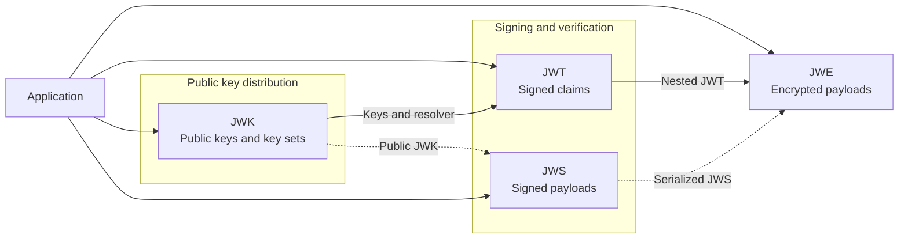

Solid arrows between modules represent explicit integration provided by their public APIs. Dashed arrows represent
format-level composition using compatible values or serialized messages.

| Module | Primary responsibility                                                                                        | Integration points                                                                                                                                       |
|--------|---------------------------------------------------------------------------------------------------------------|----------------------------------------------------------------------------------------------------------------------------------------------------------|
| `jwt`  | Issues and verifies signed Compact JWTs with application-defined claims and JWT-specific validation policies. | Uses algorithm-bound verification keys and `KeyResolver` implementations; integrates with `jwe` for nested sign-then-encrypt workflows.                  |
| `jws`  | Signs and verifies byte payloads using Compact, detached, Flattened, and General JWS workflows.               | Accepts JWK-compatible key material, custom resolvers, and opaque cryptographic backends; serialized JWS messages can be encrypted with `jwe`.           |
| `jwe`  | Encrypts and decrypts byte payloads using Compact, Flattened, and General JWE workflows.                      | Uses static keys or custom resolvers; integrates directly with `jwt` for Nested JWT and accepts serialized JWS messages as plaintext.                    |
| `jwk`  | Parses, validates, serializes, identifies, and resolves public JWKs and JWK Sets.                             | Converts to and from `jwt.VerificationKey`; `Set` implements `jwt.KeyResolver`; `Key` is compatible with the `jose.JSONWebKey` values accepted by `jws`. |

## Shared Trust Model

JOSE objects carry metadata needed for parsing, key selection, and cryptographic processing. `xjose` treats serialized
input and all metadata derived from it as untrusted until the corresponding verification or decryption operation
succeeds.

Successful parsing establishes only syntactic and structural validity. Successful signature verification or
authenticated decryption establishes the integrity of the protected data, but does not by itself establish provenance,
authorization, intended usage, or application-level acceptance.

For JWKs and JWK Sets, structural validation confirms that the document contains supported public key material. Trust
in the publisher, issuer association, and permitted usage must still be established independently by the application.

### Untrusted Inputs

The untrusted perimeter includes:

* **Serialized JOSE data:** Raw JWT, JWS, JWE, JWK, and JWK Set documents.
* **Header parameters:** Message-supplied values such as `alg`, `enc`, `kid`, `typ`, `cty`, `zip`, and `crit`.
* **Payload data:** Unverified JWT claims, embedded or detached JWS payloads, ciphertext, and decrypted plaintext until
  authentication and policy validation succeed.
* **JWK metadata:** Declared values such as `kid`, `alg`, and `use`.
* **External context:** Detached payloads, Additional Authenticated Data (AAD), and other values supplied alongside a
  JOSE object.

Protected header parameters become authenticated only after successful signature verification or JWE decryption.
Unprotected JWE header parameters are not cryptographically authenticated and remain untrusted after decryption.

These inputs may be used for parsing or candidate selection, but they cannot expand the algorithms, keys, message
classes, or behaviors permitted by trusted application configuration.

### Trusted Application Configuration

The application defines the accepted security policy through:

* **Algorithm allowlists:** Explicitly accepted signature, key-management, and content-encryption algorithms.
* **Trusted keys:** Application-supplied keys, static key sets, validated JWK Sets, and resolvers backed by
  application-controlled key records.
* **Header constraints:** Expected protected `typ`, `cty`, compression, and application-specific header values.
* **Validation policies:** JWT claim requirements and multi-signature acceptance criteria.
* **Processing bounds:** Limits for serialized input, payloads, plaintext, signatures, recipients, and JWK Set entries.
* **Time source:** The clock used for time-based JWT validation.
* **Key provenance:** Independently established trust in the source, ownership, and permitted usage of JWK and JWK Set
  documents.
* **External context:** Expected detached payloads, AAD values, tenant identifiers, resource identifiers, and other
  application context used to bind a JOSE object to the current operation.

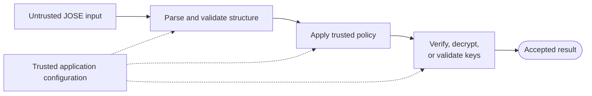

Solid arrows represent the processing flow. Dashed arrows show where trusted application configuration constrains the
operation.

For JWT, JWS, and JWE, the operation includes signature verification or authenticated decryption. For JWK and JWK Set
documents, it includes public-key, metadata, and set-level validation.

### Shared Invariants

The trust model depends on the following invariants:

1. **Parsing establishes structure, not trust:** Successfully parsed headers, claims, keys, and key sets remain
   untrusted until the required cryptographic checks and operation-specific policies succeed.

2. **Serialized input cannot expand trusted policy:** Message-supplied algorithms, identifiers, headers, and metadata
   are evaluated only against trusted application configuration. They cannot enable or override otherwise disallowed
   behavior.

3. **Identifiers only narrow trusted choices:** Values such as `kid` may select a candidate only from keys already
   trusted by the application. They do not establish key provenance, ownership, authority, or signer identity.

4. **Cryptographic validity has limited meaning:** Successful signature verification establishes that the protected
   data was signed with the selected key. Successful authenticated decryption establishes ciphertext integrity under
   the selected decryption key. Neither operation establishes issuer authority, freshness, replay safety, intended
   usage, or authorization.

5. **Acceptance requires the complete configured policy:** Parsing, key resolution, authenticated decryption, or an
   individual valid signature is insufficient by itself. A result is accepted only when every rule required by the
   operation-specific policy succeeds.

6. **External data requires independent provenance:** Structurally valid JWK and JWK Set documents, detached payloads,
   Additional Authenticated Data, and other external context are trusted only when their source and intended usage have
   been established independently by the application.

## Common Inbound Processing Flow

Verification, decryption, and processing of externally supplied key documents follow the same high-level flow.
Individual
stages may be omitted when they do not apply to a particular JOSE format:

```text
untrusted serialized input
    -> enforce pre-processing bounds
    -> parse and validate structure
    -> apply algorithm, header, or metadata constraints
    -> resolve a candidate key, where required
    -> perform cryptographic or key-material validation
    -> apply format-specific policies and post-processing bounds
    -> return the accepted result
```

This ordering preserves the following properties:

* **Reject invalid input early:** Oversized or structurally invalid input is rejected before expensive cryptographic
  processing.
* **Separate parsing from trust:** Parsing establishes the structure of headers, claims, keys, and metadata but does not
  establish their provenance or permitted usage.
* **Constrain serialized metadata:** Algorithms, identifiers, and processing parameters are evaluated only against
  trusted application configuration.
* **Limit key selection:** Message-supplied identifiers may select a candidate only from application-controlled key
  records.
* **Validate after expansion:** Decoded, decrypted, or decompressed data is checked again where processing may increase
  its size.
* **Return only fully validated results:** Parsed content, plaintext, claims, and key material are exposed as accepted
  results only after every check required by the operation-specific policy succeeds.

## JWT

The `jwt` module issues and verifies signed Compact JWTs with application-defined claims and JWT-specific validation
policies. Verification separates parsing, key resolution, signature verification, and claim validation into explicit
stages. Parsed headers and claims remain untrusted until the signature and every configured policy have been
successfully validated.

### Issuance Flow

JWT issuance uses a reusable `Signer` created from trusted application configuration. During signer construction, the
module validates the signing key, algorithm, protected-header settings, and signing backend. Each issuance call then
encodes the application-defined claims, constructs the signing input, creates the signature, and serializes the result
as a Compact JWT.

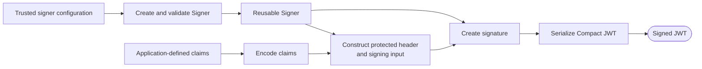

The signing algorithm, key or external backend, key ID, and protected-header parameters originate exclusively from the
trusted `Signer` configuration. Claims contribute only the JWT payload and cannot select or modify cryptographic
behavior.

### Verification Flow

Verification separates untrusted parsing and key selection from cryptographic verification and JWT-specific policy
validation.

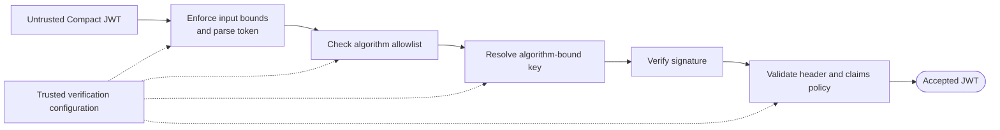

Parsing exposes the protected header and claims but does not authenticate them. The token algorithm must appear in the
configured allowlist, and key resolution must return a verification key bound to the same signing method.

The signature is verified before protected-header and claim values are accepted. The token is returned only after the
signature and every configured policy—including token type, registered claims, lifetime, and age constraints—have
succeeded.

### Key Resolution and Rotation

JWT verification is separated from application-managed key storage through `KeyResolver`. Parsed `alg` and `kid`
values are untrusted lookup hints: a resolver may use them only to select a candidate from keys already trusted by the
application.

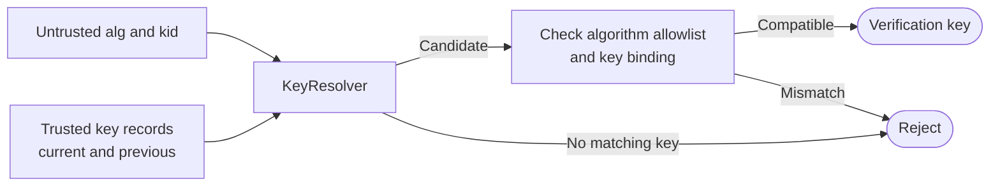

After resolution, the verifier requires the token algorithm to appear in the configured allowlist and to match the
signing method bound to the returned `VerificationKey`.

The `kid` header identifies a candidate only within the configured key source. It does not establish key ownership,
provenance, issuer authority, signer identity, or intended usage.

For key rotation, add the new verification key before issuing tokens with the corresponding signing key. Retain previous
verification keys until every token signed with them is outside the application's acceptance window, including any
configured clock leeway.

`StaticKeySet` is suitable when the application loads a fixed snapshot of current and previous keys. Custom resolvers
may integrate dynamic storage, caches, or remote key sources, but remain responsible for I/O, concurrency, refresh,
timeouts, retries, stale-key behavior, and availability.

## JWS

The `jws` module signs and verifies byte payloads using Compact and JWS JSON Serialization. Payloads are treated as
opaque byte sequences; the module does not interpret JWT claims or other application-level semantics.

Signature algorithms, protected headers, signing backends, verification keys, and multi-signature acceptance policies
are defined through trusted application configuration.

### Signing Flow

A reusable `Signer` or `MultiSigner` is created from trusted signing configuration. Each signing operation then
constructs the protected header and signing input, creates one or more signatures, and serializes the resulting JWS.

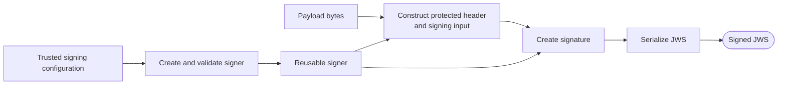

Trusted configuration determines the signature algorithm, signing key or backend, key ID, protected headers, and
serialization behavior. Payload bytes contribute only to the signing input and cannot select or modify cryptographic
parameters.

A `Signer` produces Compact JWS Serialization with an embedded or detached payload. A `MultiSigner` produces Flattened
JWS JSON Serialization for one signature and General JWS JSON Serialization for multiple signatures.

For detached JWS, the payload is included in signature computation but omitted from the serialized message.
Verification must receive the exact original payload bytes through a separate application-managed channel.

Local keys and `jose.OpaqueSigner` backends follow the same signing flow. External backends remain responsible for their
credentials, I/O, timeouts, retries, concurrency, and availability.

### Verification Flow

Verification starts with an untrusted JWS and, for detached JWS, the externally supplied payload bytes. The module
enforces processing bounds, parses the message, applies algorithm and protected-header constraints, resolves candidate
verification keys, verifies signatures, and evaluates the configured acceptance policy.

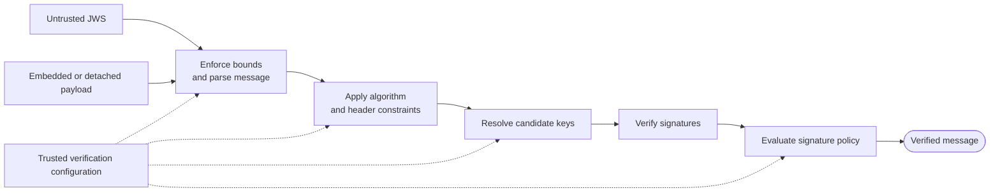

For an embedded JWS, the payload is obtained from the serialized message. For a detached JWS, verification requires the
exact external payload bytes used during signing.

Protected headers, payload bytes, key identifiers, and signatures remain untrusted until the corresponding signature
has been verified. Acceptance of the complete JWS is a separate decision determined by the configured signature policy.

A valid individual signature is therefore not sufficient by itself when the policy requires every signature, specific
canonical signer identities, or a threshold of trusted identities.

## JWE

The `jwe` module encrypts and decrypts byte payloads using Compact and JWE JSON Serialization. JWE provides
confidentiality and authenticated encryption for the intended recipient, but does not establish the identity of the
sender.

### Encryption Flow

A reusable `Encrypter` or `MultiEncrypter` is created from trusted encryption configuration. During construction, the
module validates the key-management and content-encryption algorithms, recipient keys, protected-header settings, and
compression policy.

Each encryption operation then optionally compresses the plaintext, prepares the Content Encryption Key (CEK) and
recipient key-management data, performs authenticated encryption, and serializes the resulting JWE.

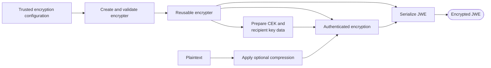

Trusted configuration determines the key-management (`alg`) and content-encryption (`enc`) algorithms, recipient keys,
protected headers, compression policy, and serialization behavior. Plaintext and external AAD contribute only data to
the cryptographic operation and cannot select or modify these parameters.

An `Encrypter` produces Compact JWE for one recipient. A `MultiEncrypter` produces Flattened JWE JSON Serialization for
one recipient and General JWE JSON Serialization for multiple recipients.

### Decryption Flow

Decryption starts with an untrusted JWE and trusted decryption configuration. The module enforces input bounds, parses
the serialized message, applies algorithm and header constraints, selects candidate key material, performs authenticated
decryption, and then decompresses and validates the resulting plaintext where required.

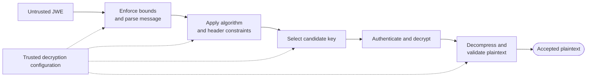

Key-management (`alg`) and content-encryption (`enc`) algorithms are evaluated independently against trusted
allowlists. Message-supplied identifiers and header values may narrow candidate-key selection, but cannot expand the
configured key source or accepted algorithms.

Plaintext is not returned unless ciphertext authentication and decryption succeed. When compression is present, the
decompressed plaintext is checked against the configured processing bounds before it is exposed to the caller.

For JWE JSON Serialization, external AAD is authenticated together with the ciphertext but is not interpreted by the
module. Applications that use AAD for context binding must compare `MultiDecrypted.AuthData` with an expected value
obtained independently.

### Multiple Recipients

General JWE JSON Serialization allows one encrypted payload to be delivered to multiple recipients. The plaintext is
encrypted once with a shared Content Encryption Key (CEK), while each recipient entry contains independent
key-management data for recovering that CEK.

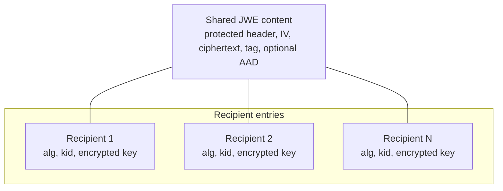

The protected header, IV, ciphertext, authentication tag, and optional external AAD are shared by all recipients. Each
recipient entry contains its own key-management algorithm (`alg`), optional key ID (`kid`), and encrypted key.

During decryption, recipient entries are evaluated against the configured key-management policy and candidate key
material. Plaintext is returned only when one eligible recipient successfully recovers the CEK and the shared
ciphertext passes authenticated decryption.

The number of recipient entries is checked before per-recipient cryptographic processing. Recipient order is positional
only and does not indicate preference, priority, or trust.

### Nested JWT

Nested JWT uses the **sign-then-encrypt** pattern. The issuer signs the claims as a Compact JWT and encrypts the
resulting token as a Compact JWE. The recipient reverses the process by decrypting the outer JWE and then verifying the
recovered JWT.

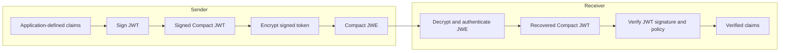

The protected JWE header identifies the encrypted plaintext as a JWT through `cty=JWT`.

The outer JWE provides confidentiality and authenticated encryption for the intended recipient. The inner JWT
authenticates the signed claims under the configured verification key and applies JWT-specific claim and header
policies.

The two layers provide independent guarantees: successful JWE decryption does not establish who issued the message,
while successful JWT verification does not provide confidentiality. Claims are accepted only after both layers and
every configured JWE and JWT policy succeed.

## JWK and JWK Sets

The `jwk` module provides operations for individual public JSON Web Keys and validated JWK Sets. Keeping both models in
one module ensures consistent public-key validation, metadata constraints, and conversion to algorithm-bound
`jwt.VerificationKey` values.

Validated parsing, construction, and conversion functions accept public asymmetric key material only. The module
performs no network retrieval, discovery, caching, background refresh, or automatic retries.

### Individual-Key Parsing and Validation

Parsing begins with an untrusted JWK document. The module decodes the JSON representation and validates that it contains
supported public asymmetric key material.

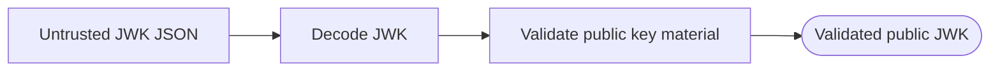

Successful JSON decoding establishes only the document structure. Validated parsing additionally rejects private keys,
symmetric secrets, empty or incomplete keys, malformed key material, and unsupported key types.

A validated JWK is not automatically trusted. The application must independently establish the key's source, ownership,
intended usage, and association with an issuer or signer.

### Verification-Key Conversion

A validated public JWK can be converted into a `jwt.VerificationKey` bound to an explicitly selected signing method.
The conversion verifies that the public key material and optional JWK metadata are compatible with that method.

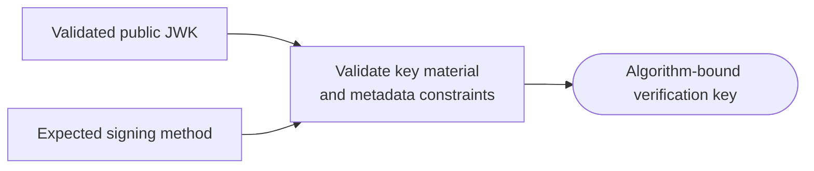

The JWK `alg` and `use` values, when present, constrain conversion but do not select the signing method or establish
trust in the key. The expected method, key source, and permitted usage remain trusted application configuration.

### Thumbprint Flow

RFC 7638 thumbprints provide a deterministic identifier derived from public key material.

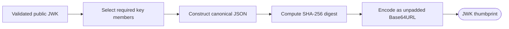

The thumbprint is derived only from the canonical public key members. JWK metadata such as `kid`, `alg`, and `use` does
not affect the result.

A matching thumbprint identifies the same public key material. It does not establish ownership, provenance, issuer
association, permitted usage, authorization, or trust.

### Set Parsing and Indexing

JWK Set parsing decodes the document, enforces the configured key-count limit, validates every public JWK, applies
set-level invariants, and builds an index for deterministic `kid` lookup.

```mermaid
flowchart LR
    Input[Untrusted JWK Set JSON]
    Decode[Decode JWK Set]
    Count[Enforce key-count limit]
    Validate[Validate every public JWK]
    Invariants[Enforce set invariants]
    Index[Index named keys by kid]
    Set([Validated JWK Set])
    Input --> Decode
    Decode --> Count
    Count --> Validate
    Validate --> Invariants
    Invariants --> Index
    Index --> Set
```

The key-count limit is enforced after JSON decoding but before per-key validation and set construction. Applications
reading JWK Sets from files, networks, or other external sources must independently limit the number of serialized
bytes accepted before calling `ParseSet` or `ParseSetWithLimit`.

A set containing multiple keys requires every key to have a unique, non-empty `kid`. A set containing one anonymous key
can resolve only JWTs that also omit `kid`; it is not used as a fallback for tokens containing an unknown key ID.

### Deterministic Resolution

`Set` implements `jwt.KeyResolver`. Resolution combines the validated set state with the untrusted protected `alg` and
`kid` header values to produce one algorithm-bound `jwt.VerificationKey`.

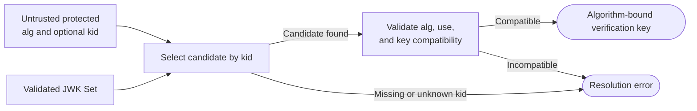

When `kid` is present, it must exactly match a named key in the validated set. When `kid` is absent, resolution succeeds
only when the set contains one anonymous key. An anonymous key is not used as a fallback for an unknown key ID.

The JWK `alg` and `use` values, when present, constrain resolution but do not select the verification algorithm. The JWT
verifier independently requires the token algorithm to appear in its configured allowlist and to match the signing
method bound to the resolved `jwt.VerificationKey`.

### Key Rotation and Publication

During key rotation, the application publishes the current and previous public verification keys in the same JWK Set.
New tokens reference the current key through `kid`, while existing tokens continue to resolve to the previous key during
the transition period.

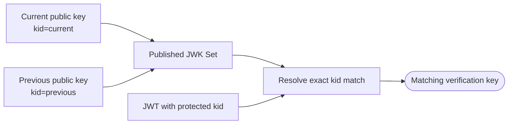

The application must publish the new verification key before issuing tokens with the corresponding signing key.
Previous public keys must remain available until every token signed with them is outside the application's acceptance
window, including expiration, configured leeway, and any expected propagation or processing delay.

`Set` does not manage the rotation lifecycle itself. The application is responsible for adding and removing keys,
publishing updated documents, and coordinating the transition between issuers and verifiers.

Validated sets serialize as standard `{"keys":[...]}` documents containing public asymmetric key material only.

## Cross-Module Workflows

The modules compose through public data types and interfaces while preserving their individual validation and trust
boundaries.

### JWK-Set-Backed JWT Verification

A JWK Set is obtained from an application-approved source, parsed into a validated `jwk.Set`, and passed directly to the
JWT verifier as a `jwt.KeyResolver`.

During verification, the protected `kid` selects a candidate from the set, while the token algorithm must independently
appear in the verifier's allowlist and match the signing method derived from the selected JWK.

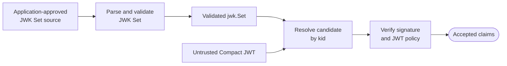

JWK Set parsing validates public key material, metadata constraints, and set-level invariants. It does not establish
that the set is authoritative for a particular issuer or token class.

The application remains responsible for authenticating the source, binding the set to the expected issuer and usage,
and defining the JWT algorithm, claim, and protected-header policies.

### Public-Key Publication

Public-key publication converts application-managed verification keys into public JWKs, combines them in a validated
JWK Set, and serializes the set as a standard `{"keys":[...]}` document.

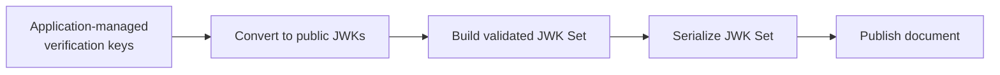

Only public asymmetric key material enters the publication path. Private keys and symmetric secrets are rejected and
cannot appear in the serialized JWK Set.

The module creates the document but does not publish or distribute it itself. The application remains responsible for
transport security, cache policy, availability, and coordinating updates with key rotation.

### Signed and Encrypted Claims

Confidential signed claims use the **sign-then-encrypt** pattern. The issuer signs application-defined claims as a
Compact JWT and encrypts the resulting token as a Compact JWE. The recipient decrypts the outer JWE and then verifies
the recovered JWT.

```mermaid
flowchart LR
    Claims[Application-defined claims]
    Sign[Sign JWT]
    Signed[Signed Compact JWT]
    Encrypt[Encrypt signed token]
    Protected[Compact JWE]
    Decrypt[Decrypt and authenticate JWE]
    Recovered[Recovered Compact JWT]
    Verify[Verify JWT signature and policy]
    Result([Verified claims])
    Claims --> Sign
    Sign --> Signed
    Signed --> Encrypt
    Encrypt --> Protected
    Protected --> Decrypt
    Decrypt --> Recovered
    Recovered --> Verify
    Verify --> Result
```

The protected JWE header identifies the encrypted plaintext as a JWT through `cty=JWT`.

The two layers provide independent guarantees. The outer JWE provides confidentiality and authenticated encryption for
the intended recipient. The inner JWT authenticates the signed claims under the configured verification key and applies
JWT-specific claim and protected-header policies.

Successful JWE decryption does not replace JWT verification, and successful JWT verification does not provide
confidentiality. Claims are accepted only after both layers and every configured JWE and JWT policy succeed.
