# Architectural Design

This document defines the architectural boundaries, trust model, security invariants, and core data flows of the
`xjose` modules.

## Design Goals

`xjose` follows a focused set of architectural and security principles:

* **Explicit trust configuration:** Accepted algorithms, keys, protected headers, validation policies, and resource
  limits come from trusted application configuration rather than untrusted serialized JOSE metadata.
* **Independent Go modules:** JWT, JWS, JWE, and JWK are independently installable modules with focused APIs and
  limited coupling between formats.
* **Secure composition:** Modules can be combined for workflows such as JWK-Set-backed JWT verification and nested
  sign-then-encrypt tokens without weakening their individual security boundaries.
* **Bounded processing:** Serialized input, payloads, plaintext, signatures, recipients, and key sets are constrained
  before expensive processing and checked again after decoding or decompression where amplification may occur.
* **Deterministic key selection:** Untrusted header metadata such as `kid` may select only among keys already trusted by
  the application; it cannot establish trust or implicitly expand the accepted key set.
* **External cryptography:** Private-key operations can be delegated to cloud KMS, HashiCorp Vault, hardware security
  modules, PKCS#11 adapters, remote signing services, or custom application backends.
* **No hidden I/O:** The modules perform no implicit network requests, background refreshes, or automatic retries.
  Application-provided resolvers and cryptographic backends remain responsible for their own I/O and runtime behavior.

## Module Relationships

The modules can be used independently or composed through their public APIs.

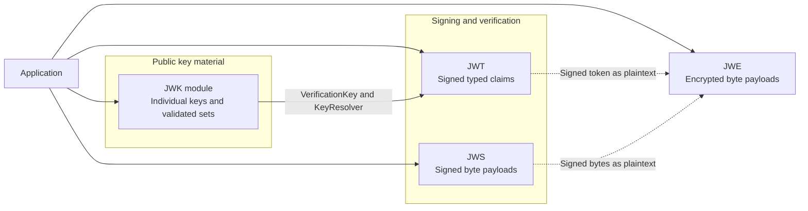

Solid arrows represent direct public API integration. Dashed arrows represent optional format composition: signed JWT
or JWS messages can be encrypted as opaque JWE plaintext.

| Module | Primary responsibility                                                                                         | Composition points                                                                                                                                              |
|--------|----------------------------------------------------------------------------------------------------------------|-----------------------------------------------------------------------------------------------------------------------------------------------------------------|
| `jwt`  | Issues and verifies signed Compact JWTs with typed claims and JWT-specific validation policies.                | Accepts algorithm-bound verification keys and custom key resolvers; signed JWTs can be encrypted as opaque JWE plaintext.                                       |
| `jws`  | Signs and verifies arbitrary byte payloads using Compact and JSON JWS Serialization.                           | Supports static keys, custom resolvers, detached payloads, multiple signatures, and application-managed cryptographic backends.                                 |
| `jwe`  | Encrypts and decrypts arbitrary byte payloads using Compact and JSON JWE Serialization.                        | Encrypts raw data, signed JWTs, or JWS messages as opaque plaintext; recipient keys are selected through trusted application configuration.                     |
| `jwk`  | Parses, validates, exports, identifies, publishes, and resolves public JSON Web Keys and JWK Sets.             | Converts public keys into algorithm-bound JWT verification keys and provides validated sets that implement `jwt.KeyResolver` for deterministic `kid` selection. |

## Shared Trust Model

JOSE objects carry the metadata required to process them, but `xjose` treats all serialized input and message-derived
metadata as untrusted until the complete operation-specific policy succeeds.

Successful parsing establishes syntactic and structural validity only. It does not establish origin, ownership,
authority, intended use, or application-level acceptance.

### Untrusted Inputs

The untrusted perimeter includes:

* **Serialized JOSE data:** Raw JWT, JWS, JWE, JWK, and JWK Set input.
* **Header parameters:** Protected and unprotected parameters such as `alg`, `enc`, `kid`, `typ`, `cty`, `zip`, and
  `crit`.
* **Payload data:** Unverified JWT claims, embedded or detached payloads, plaintext supplied for processing, and
  ciphertext.
* **JWK metadata:** Declared properties such as `alg` and `use`.
* **External context:** Detached payloads and Additional Authenticated Data (AAD), unless their origin and integrity
  have
  already been established by the application.

These values may influence parsing and lookup, but they cannot expand the set of algorithms, keys, headers, or
behaviors accepted by trusted application policy.

### Trusted Application Configuration

The application establishes trust through:

* **Algorithm constraints:** Explicit allowlists for accepted signing, verification, key-management, and
  content-encryption algorithms.
* **Trusted key material:** Application-supplied keys, static key sets, and application-managed resolvers.
* **Header policies:** Expected protected-header values and rules for `typ`, `cty`, compression, and critical
  extensions.
* **Validation policies:** JWT claim-validation rules and multi-signature acceptance criteria.
* **Operational bounds:** Limits for serialized input, payloads, plaintext, signatures, recipients, and key sets.
* **Time source:** An application-controlled clock used for time-based claim validation.
* **Key provenance:** Application-established trust in the origin and intended use of JWK and JWK Set documents.

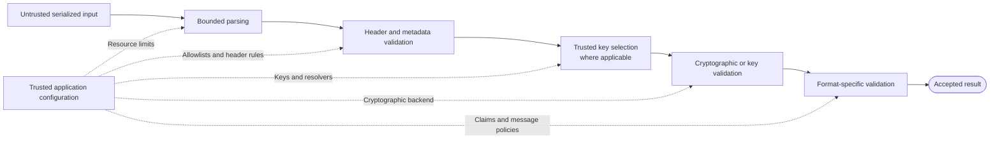

Solid arrows represent the processing flow. Dashed arrows show how trusted application configuration constrains each
stage.

For JWK and JWK Set workflows, public-key and set-level validation replaces cryptographic verification or decryption
where those operations are not applicable.

### Shared Invariants

The shared trust model relies on the following invariants:

1. **Parsing establishes structure, not trust:** Successfully parsed headers, claims, keys, and key sets remain
   untrusted until every required operation-specific validation, policy, and, where applicable, cryptographic check
   succeeds.
2. **Serialized input cannot expand trusted policy:** Message-provided algorithms, identifiers, headers, and metadata
   are evaluated only against trusted application configuration. They cannot enable, alter, or override otherwise
   disallowed behavior.
3. **Identifiers only narrow trusted choices:** Values such as `kid` may select among candidates already trusted by the
   application. They do not establish key provenance, ownership, authenticity, or authority.
4. **Cryptographic validity does not establish application trust:** A valid signature proves that a message verifies
   under the selected key. Successful authenticated decryption proves ciphertext integrity under the decryption key.
   Neither result establishes issuer authority, freshness, replay safety, or application-level authorization.
5. **Acceptance requires the complete configured policy:** Successful parsing, key resolution, decryption, or an
   individual valid signature does not imply acceptance by itself. A result is accepted only when every rule required
   by the operation-specific policy succeeds.
6. **Validation does not establish provenance:** Structurally valid JWK or JWK Set data, detached payloads, and Additional
   Authenticated Data are trusted only when their origin and intended use have been established separately by the
   application.

## Common Inbound Processing Pattern

Verification, decryption, and externally supplied key material follow the same high-level processing pattern:

```text
untrusted serialized input
    -> resource-limit checks
    -> bounded structural parsing
    -> protected-header or metadata validation
    -> trusted key selection, where applicable
    -> cryptographic or key-material validation
    -> format-specific validation and post-expansion limits
    -> accepted result
```

The ordering preserves several security properties:

* **Reject early:** Oversized input is rejected before expensive parsing or cryptographic processing.
* **Parse without trusting:** Successful parsing establishes structure only; headers, claims, keys, and metadata remain
  untrusted.
* **Constrain message metadata:** Algorithms, identifiers, and processing parameters are evaluated only against trusted
  application policy.
* **Narrow key selection:** Key identifiers select from application-approved key material rather than establishing new
  trust.
* **Recheck after expansion:** Decoded and decompressed data is validated again against configured limits.
* **Accept atomically:** A result is accepted only after every check required by the operation-specific policy succeeds.

## JWT

The `jwt` module issues and verifies signed Compact JWTs with typed claims. It separates bounded parsing, signature
verification, and JWT claim validation. Parsed headers and claims remain untrusted until the complete verification
policy succeeds.

### Issuance Flow

Issuance starts from typed claims and trusted signer configuration. The module validates the signing configuration,
encodes the claims, constructs the protected header and signing input, creates the signature, and serializes the result
as a Compact JWT.

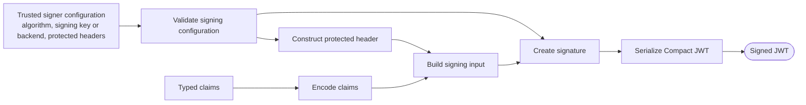

The algorithm, signing key, and protected headers originate exclusively from trusted signer configuration. Claims
contribute payload data only and cannot select or modify cryptographic behavior.

### Verification Flow

Verification proceeds in a strict order: the serialized token is bounded and parsed, message-provided metadata is
evaluated against trusted policy, a compatible verification key is resolved, the signature is verified, and only then
are the claims accepted.

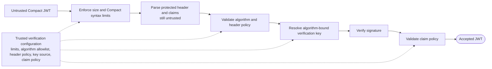

The token algorithm is treated as untrusted metadata and must match the configured allowlist. Key resolution must
return a verification key bound to that algorithm.

Parsed headers and claims remain untrusted until signature verification and every configured claim policy succeed.
Only then is the token accepted.

### Key Resolution and Rotation

Key resolution separates JWT verification from application-managed key storage. The untrusted `alg` and optional `kid`
headers narrow the search within a trusted key source, while algorithm compatibility determines whether the selected
key may be used.

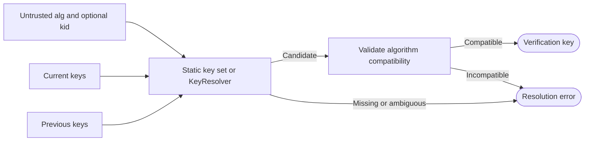

`kid` acts only as a selector among keys already trusted by the application. It does not establish key ownership,
provenance, issuer authority, or intended use.

Static key sets are appropriate when keys are loaded through application configuration. Custom resolvers can integrate
application-managed storage, caches, or remote key sources and remain responsible for concurrency, refresh, retries,
stale-key behavior, and availability.

## JWS

The `jws` module signs and verifies arbitrary byte payloads using Compact and JSON JWS Serialization. It treats payloads
as opaque data and does not interpret JWT claims or other application-level semantics.

Algorithms, protected headers, signing backends, verification keys, and signature acceptance policies are defined by
trusted application configuration.

### Signing Flow

Signing starts with opaque payload bytes and trusted signing configuration. The module constructs the signing input,
creates the signature, and encodes the result using the configured JWS serialization.

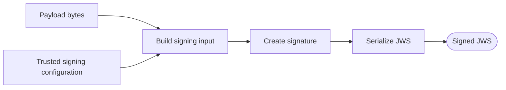

Trusted configuration determines the algorithm, signer, protected headers, and serialization mode. Payload bytes
contribute only to the signing input and cannot alter cryptographic behavior.

For detached JWS, the payload participates in signature creation but is omitted from the serialized message.
Verification must receive the exact same payload bytes through a separate application-managed channel.

Local and opaque signers follow the same construction flow. Credentials, network access, retries, and availability of
external cryptographic backends remain application-managed.

### Verification Flow

Verification starts from an untrusted JWS message and, for detached serialization, the externally supplied payload
bytes. The module enforces resource limits, parses the message, validates protected headers, resolves trusted
verification material, verifies each signature, and evaluates the configured signature policy.

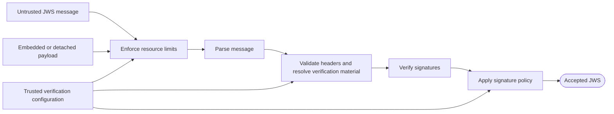

Protected headers, payload bytes, and signatures remain untrusted until cryptographic verification and the configured
message-acceptance policy succeed.

Individual signature validity and acceptance of the complete JWS message are separate decisions. A cryptographically
valid signature does not make the message acceptable by itself.

## JWE

The `jwe` module encrypts and decrypts arbitrary byte payloads. JWE provides confidentiality and ciphertext integrity
for the intended recipient, but does not by itself authenticate the original sender.

### Encryption Flow

Encryption starts from plaintext and trusted configuration. The module validates the encryption policy, constructs the
protected header, optionally compresses the plaintext, establishes the content-encryption key and recipient
key-management data, performs authenticated encryption, and serializes the resulting JWE.

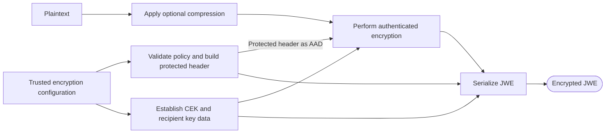

Trusted configuration determines the key-management and content-encryption algorithms, recipient keys, protected
headers, compression policy, and serialization format. Plaintext contributes only encrypted payload data and cannot
alter cryptographic behavior.

### Decryption Flow

Decryption starts from an untrusted JWE message and trusted decryption configuration. The module bounds and parses the
serialized input, validates shared and recipient headers, resolves compatible key material, performs authenticated
decryption, optionally decompresses the plaintext, and enforces the final plaintext limit.

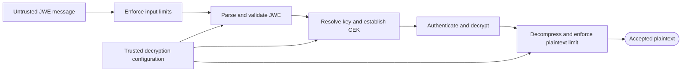

Key-management (`alg`) and content-encryption (`enc`) algorithms are evaluated independently against trusted
allowlists. Recipient metadata can narrow key selection but cannot expand the trusted key set or accepted algorithms.

Plaintext is not exposed until authenticated decryption succeeds. When compression is enabled, the expanded plaintext
is checked again against the configured limit. External AAD, when present, must match the exact bytes authenticated by
the JWE.

### Multiple Recipients

General JWE JSON Serialization allows one encrypted payload to be delivered to multiple recipients. The plaintext is
encrypted once using a shared content-encryption key, while each recipient entry contains independent key-management
data required to recover that key.

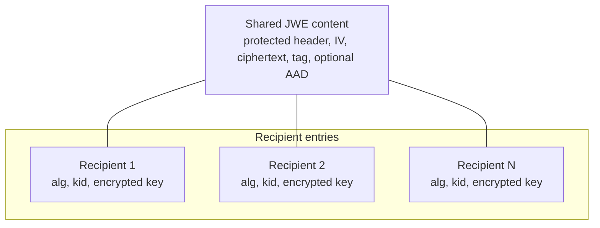

During decryption, recipient entries are evaluated against the trusted key-management policy and configured key
source. Plaintext is returned only when one eligible recipient produces successful authenticated decryption.

Recipient traversal is bounded by the configured limit, preventing an untrusted message from forcing an unlimited
number of key-resolution or cryptographic attempts.

### Nested JWT

Nested JWT combines two independent protection layers. The sender signs the claims first and then encrypts the resulting
Compact JWT. The receiver reverses the process by decrypting the outer JWE and verifying the recovered signed token.

```mermaid
flowchart LR
    subgraph Sender
        direction LR
        Claims[Typed claims]
        Sign[Sign JWT]
        Signed[Signed Compact JWT]
        Encrypt[Encrypt signed token]
        Protected[Encrypted JWE]
        Claims --> Sign
        Sign --> Signed
        Signed --> Encrypt
        Encrypt --> Protected
    end

    subgraph Receiver
        direction LR
        Decrypt[Decrypt JWE]
        Recovered[Recovered signed JWT]
        Verify[Verify signature and claims]
        Result[Accepted claims]
        Protected --> Decrypt
        Decrypt --> Recovered
        Recovered --> Verify
        Verify --> Result
    end
```

The outer JWE provides confidentiality and ciphertext integrity. The inner JWT provides signature protection and
JWT-specific claim validation under trusted verification policy.

The layers remain independent: successful decryption does not authenticate the sender, and successful JWT verification
does not provide confidentiality.

## JWK and JWK Sets

The `jwk` module owns both individual public JSON Web Keys and validated JWK Sets. Keeping these operations in one
module provides one definition of valid public key material, one metadata-compatibility model, and one conversion path
to algorithm-bound JWT verification keys.

Validated operations accept public asymmetric key material only. The module performs no network retrieval, caching,
refreshes, or retries.

### Individual-Key Parsing and Validation

Parsing starts from untrusted JWK JSON. The module decodes the document and validates that it contains supported public
asymmetric key material.

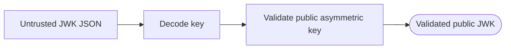

Successful JSON decoding establishes structure only. Validated parsing additionally rejects private, symmetric, empty,
incomplete, malformed, and unsupported key material. Trust in the source and intended purpose must still be established
by the application.

### Verification-Key Conversion

A validated JWK can be converted into an algorithm-bound verification key after its key material and declared metadata
are checked against an expected verification algorithm.

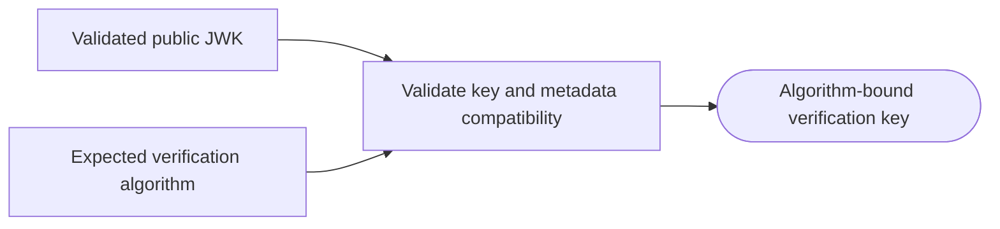

Declared `alg` and `use` metadata constrains compatibility but does not establish trust in the key or its issuer. The
expected signing method remains trusted application configuration.

### Thumbprint Flow

RFC 7638 thumbprints provide a deterministic identifier derived from public key material.

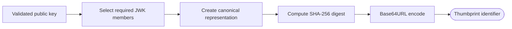

A thumbprint identifies the public key material itself. It does not prove ownership, provenance, authorization, or
trust for a particular issuer.

### Set Parsing and Indexing

JWK Set parsing decodes and validates every public key, enforces invariants across the complete set, and builds an index
for deterministic lookup. The key-count limit is applied before set construction; applications loading remote documents
must independently bound the response body.

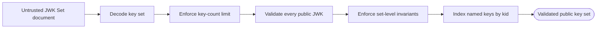

A multi-key set requires every key to have a non-empty, unique `kid`. A single anonymous key is supported only for
JWTs that also omit `kid`.

### Deterministic Resolution

`Set` implements `jwt.KeyResolver`. Resolution combines trusted set state with the untrusted protected `alg` and `kid`
header values and must produce exactly one compatible verification key.

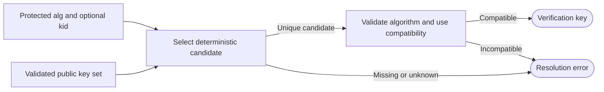

When `kid` is present, it requires an exact match within the trusted set. When it is absent, resolution succeeds only
for a single anonymous key. The JWT verifier independently requires the resolved algorithm to be allowlisted.

### Key Rotation and Publication

Key rotation publishes current and previous verification keys together during a transition period. Tokens continue to
resolve through protected `kid` values while both keys remain accepted.

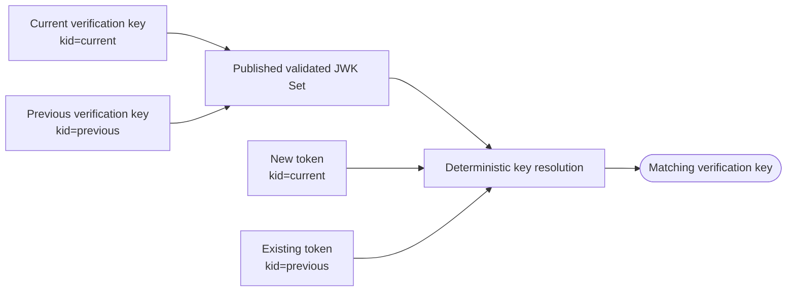

Previous public keys remain published until tokens signed with them can no longer be accepted under the application's
maximum token lifetime and rotation policy. Validated sets serialize as standard `{"keys":[...]}` documents containing
public key material only.

## Cross-Module Workflows

The modules compose through public data types and interfaces while preserving their individual validation and trust
boundaries.

### JWK-Set-Backed JWT Verification

A JWK Set document is validated and converted into a trusted in-memory key set before it participates in JWT
verification. The JWT verifier then resolves a compatible verification key using the token algorithm and optional
`kid`.

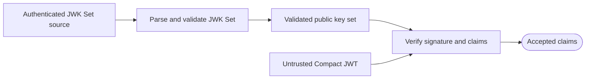

JWK Set parsing validates key material and set-level invariants, but it does not establish that the source is authoritative
for a particular issuer. Source authentication and issuer-to-key-set binding remain application responsibilities.

### Public-Key Publication

Public-key publication derives public material from application-managed signing keys, converts it into validated JWK
values, builds a validated key set, and serializes the result as a standard JWK Set document.

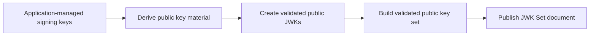

Only public key material enters the publication path. Private signing material remains outside JWK and JWK Set output.

### Signed and Encrypted Claims

Authenticated and confidential claims use a sign-then-encrypt composition. The sender signs the claims as an inner JWT
and encrypts that token as JWE plaintext. The receiver decrypts the outer JWE and then verifies the recovered JWT.

```mermaid
flowchart LR
    Claims[Typed claims]
    Sign[Sign JWT]
    Signed[Signed Compact JWT]
    Encrypt[Encrypt signed token]
    Protected[Encrypted JWE]
    Decrypt[Decrypt JWE]
    Recovered[Recovered signed JWT]
    Verify[Verify signature and claims]
    Result([Accepted claims])
    Claims --> Sign
    Sign --> Signed
    Signed --> Encrypt
    Encrypt --> Protected
    Protected --> Decrypt
    Decrypt --> Recovered
    Recovered --> Verify
    Verify --> Result
```

The two layers provide different guarantees. JWE protects confidentiality and ciphertext integrity, while the inner
JWT provides signature protection and claim validation. Successful decryption does not replace JWT verification, and
JWT verification does not provide confidentiality.